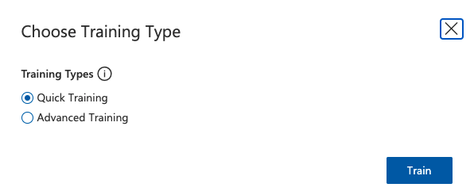

This tutorial is designed for our Big Data and Materials Informatics students to learn how to use Custom Vision. Custom Vision is one of the cognitive services provided by Microsoft Azure that enables users to easily build and train custom image classification or object detection models. With such Cloud tool, users can easliy use pretrained model to do supervised machine learning for their own image data without too much coding. This is a good example of how to use cognitive services on Azure, which is a collection of pre-build APIs that enable users to add intelligent features to their applilcations without needing to build the underlying AI models from scratch. 

# Azure Custom Vision for Materials Science

Authors: [Hang Hu](https://github.com/hanghu) & [Luna Huang](https://github.com/lunayuehuang) 

Before getting started, git clone or download this repository (https://github.com/lunayuehuang/Mse544-CustomVision.git) to have all the test data on your local machine.

# Table of Content
- [Part 1 Using Azure Custom Vision to do Image Classification](#part1)
  - [1.1 Create resources on Azure Custom Vision](#part1_1)
  - [1.2 Create a image classification project using Azure Custom Vision web interface](#part1_2)
  - [1.3 Upload images with tags and train model](#part1_3)
  - [1.4 Quick test - using our model for prediction](#part1_4)
- [Part 2 Using Azure Custom Vision to do image object detection](#part2)
  - [2.1 Create an object detection project using Azure Custom Vision web interface](#part2_1)
  - [2.2 Using ImageJ to label images for Object Detection](#part2_2)
  - [2.3 Upload images with labels for training](#part2_3)
  - [2.4 Train the model](#part2_4)
  - [2.5 Quick test - prediction using our trained model](#part2_5)
- [Reference and Further Reading](#reference)


# Tutorial Part 1
## Using Azure Custom Vision to do Image Classification  <a name="part1"></a>

### 1.1 Create resources on Azure Custom Vision <a name="part1_1"></a>

Go to the Azure Custom Vision portal: [https://www.customvision.ai/](https://www.customvision.ai/) and sign in with your uw-email (it will automatically re-direct you to the UWID authentication page). The main page of the Azure Custom Vision looks like this:


Click the gear-like setting button, and then in the following page click ```create new``` to create a resource to host projects.  


In the following prompts, fill out the entries for creating the resources as follows, replacing the name of the subscription with (```MSE544_2024```),  the name of Resource Group with (```rg-amlclass-<your_UWNetID>```) and the name of the Resource (```cv_<your_UWNetID>```):


Once the resource is created, you can find out the ```Key```, ```Endpoint``` and ```Resource Id``` as follows, which will be useful when you incorporate projects using python scripts.
 


### 1.2 Create a image classification project using Azure Custom Vision web interface <a name="part1_2"></a>

Use the the eye-like button on the upper left corner to navigate back to the project gallery page (the main page). Then click ```New Project``` to create a project. 


Once a project is created, go into the project page, it will looks like this:


The most important takeaway is that the buttons on top bar help you navigate to different stages of the project. 


### 1.3 Upload images with tags and train model <a name="part1_3"></a>

In this tutorial, we will be using a very small dataset, with 10 clear and 10 crystals images taken from the MARCO dataset to train a model. All the images are stored in ```marco_subset``` folder in this repository. Go to the project page, select ```Training Images``` from the top bar, and then ```Add images```. 


Then, select all images (using ```shift``` on your keyboard) from ```macro_subset/crystatls_train``` to upload them. 


At the next prompt, type ```crystals``` in the field  ```"My Tags"```, and then click upload.


Repeat the same step for images in ```macro_subset/clear_train``` with another tag ```clear```.

Once you finish uploading and tagging the images, you will find on the left-hand sidebar a summary of pictures uploaded.


Now, the model is ready for training. Click the ```Train``` button on the top bar and use ```Quick Training``` to train the model.




When training is finished (it will takes less than 5 minutes), you will obtain a page summarizing the training results and metrics.


### 1.4 Quick test - using our model for prediction <a name="part1_4"></a>

Once you have a model, you can do ```Quick Test``` with images in ```macro_subset/clear_test``` and ```macro_subset/crystals_test``` to see how this simple model performs.

For example, click ```Quick Test```: 


Then, in the window prompt, choose ```Browse local files```, and select one of the images from the test folders.


It will automatically run the image classification on the selected image; the output results will look like this:


As you can see, Custom Vision really provides a code free expereience for you to easily running image classfication. 


# Tutorial Part 2 
## Using Azure Custom Vision to do image object detection <a name="part2"></a>
Object Detection is a computer vision technique that involves identifying and localizing objects within an image or a video. It has many applications in materials characterization data processing and materials manufacturing qaulity control. 

The goal of object detection is to detect objects of interest in an image and accurately localize them by drawing bounding boxes around them. The algorithms typically consist of two main components: a feature extractor and a classifier/regressor. 

Feature extractor is responsible for extracting useful features from the input images that are relevant to object detection. You can see this a serires of numerical respretatives that captures the characteristic of the images. The commone feature extraction techiniques include convolutional neural networks (CNNs) and their variants such as ResNet, VGG and inceptions. A simple explanation of CNN is included in our prerequisite class MSE 542, and a recording of it is shared on our course canvase page. 

The classifer/regressor takes the extracted features and predicts the class label of each object in the image and ints corresponding bounding box coordinats. There are many different algorithems for this task as well, including region-based methods suchas Faster R-CNN and one-stage methods such YOLO and SSD. 

 

### 2.1 Create an object detection project using Azure Custom Vision web interface <a name="part2_1"></a>

Similar to step 1.2, we will create a new custom vision project, but this time we will select "Object Detection" instead, as follows:


For object detection, image labeling is a crucial step as it involves annotating an image with the locations and categories of ojects present in it. Image labeling is a manual process and it usually performed by human annotators who have domain knowlege of the searching target, or pretrained for certain datasets. The annotator needs to carelly label each object in an image. This process is time-sonsuming and expensive.   However, the training results strongly tires in with the quality of the how the images are labelled, especially how the bounding boxes are choose. Unlike segmentation, most of the ojbect detection uses rectangle bounding boxes. Labeling the images with precise bounding box around the detection ojbect is very important. Note: for some of the object, bounding box can overlap each other as long as each contains complete target ojbect.

There are many softwares can help us achieve labeling of the image. ImageJ is choosen in this tutorial because it is a open-source software package and is widely used in the scientific community. 

ImageJ supports a wide range of image formats, and can handle multi-dimensional images such as  time-lapse and z-stacks. It also provides comprehensive sets of tools for image analysis and prcessing, including filters, thresholding, segmentation, and measurement. It is a versatile tool that can be useful for you beyond our class. 

### 2.2 Using ImageJ to label images for Object Detection <a name="part2_2"></a>

#### Install ImageJ 
To install ImageJ, check this website [https://imagej.nih.gov/ij/download.html](https://imagej.nih.gov/ij/download.html)
markdown
If you are mac user, you might need to enable installation of applications from unidentified developers by Apple. To do that, see this website 
```
https://support.apple.com/guide/mac-help/open-a-mac-app-from-an-unidentified-developer-mh40616/mac
```

 The user interface of ImageJ looks like this:


####  
#### Change measurement settings
Before labeling, go to ```Analyze``` > ```Set Measurement```: 


At the prompt, choose ```Bounding rectangle``` and ```Add to overlay```, then click ```ok```


#### Label molecules in images

For each of the images, the labeling work flow is generally:

1. Open images using ```File``` > ```Open```, and locate an image in the ```molecules``` folder


2. Use the ```Rectangle``` selection tool and select on the image only one molecule, and then press M on your keyboard. A ```Results``` window will be prompted out with all the rectangle coordinates. Repeat this step until all the molecules in the image are labeled.


3. Select the ```Results``` window and right click, choose ```Save As``` to save labels as a text file. The file name should be same as the image, but with an extention as  ```.txt```.


To save time for this tutorial, we have labeled all images under ```molecules/labels```. However, to ensure that you are familiar with this workflow, choose at least 3 images for practice. 

### 2.3 Upload images with labels for training <a name="part2_3"></a>

Create a Jupyter notebook in the same folder as this tutorial (**/Mse544-CustomVision**), and name it ```image_upload.ipynb```. The quickest way I would like to do this in VS Code is to use Command Palette by "Command+Shift+p (Mac)" or "Ctrl+Shift+p (PC)" and type "notebook" in the Command Palette, and then choose the "Create:New Jupyter Notebook" from the prompt. Don't forget to save the notebook in the folder you created for this tutorial. 

#### Pre-requisites
Python constantly evolves and progresses. Sometimes, it is challenging to obtain consistent experience running the notebook. To make sure the code will run smoothly no matter what version of python you newly installed, it is nice to learn how to establish python environment on your computer. So let's spend a few minutes first to learn how to create and activate a conda environment. 

First, make sure you have already installed [Anaconda](https://www.anaconda.com/products/distribution) or [miniconda](https://docs.conda.io/en/latest/miniconda.html). 

Then create an environment named MSE544CVpy310 (feel free to replace "MSE544CVpy310" in the code with any name you want to give your environment for this notebook) 

```
conda create -n MSE544CVpy310 python=3.10
```
Reload the developer window of VScode 

Then create a new cell and run the following command in your python notebook 

```
conda activate MSE544CVpy310
```
In your VSCode, click the kernel selection button at the top right corner of the notebook window, and choose MSE544CVpy310 as your python environment. 


Now you have an new environment set up for your notebook. You can always use this environment to run this code. 

Install the required libraries using pip:
- Azure Custom Vision client library
- sklearn 
- scikit-image 
run the following commands in your python notebook 
```
%pip install azure-cognitiveservices-vision-customvision scikit-learn scikit-image
```
The main purpose of this notebook is be able to upload pre-labeled images to Azure Custom Vision. We need to read the image path, labeled object and  location and the size of labels in the images (coordinates for the left bottom corner, the width and height) into a data frame, then we loop through the data frame using Custom Vision SDK library functions to upload the images and annotations.  

#### Helper Classes

In order to simplify the process of using python scripts to build object detection projects on Azure Custom Vision, two helper classes are built:

- ```labeledImage``` in the util.py: a data structure class used for collecting the information and labels of an image. Within this class, a function is included:
    - ```add_labels_from_file(str tag, str label_path)```: a helper function to read all the rectangular boxes in ImageJ format, note all of them should be associate with the same tag. 

- ```AzureCVObjectDetectionAPI``` in the azureapi.py: an API class that simplifies the process of identifying which Azure Custom Vision Project you are doing, and uploading images with the labels to that object for object detection in batches for object detection training. The code - ```upload_training_images(List(ImagesLables) labeled_images)``` will upload labeled images to your project.

The detailed documentation are located in the files ```util.py``` and ```azureapi.py```

#### Create Python scripts for image uploading

1. Import all necessary packages and helper functions/classes.
    ```python
    import os
    from util import labeledImage
    from azureapi import AzureCVObjectDetectionAPI
    from sklearn.model_selection import train_test_split
    ```
2. Using the helper class ```labeledImage``` to store all the image labels.

    ```python
    molecules_dir = './molecules/'
    labels_dir = './molecules/labels/'

    labeled_images = []
    tag = 'molecule'

    for file in os.listdir(molecules_dir):
        if file.endswith(".jpeg"):
            image_path = os.path.join(molecules_dir, file)
            label_path = os.path.join(labels_dir, file.split('.')[0] + '.txt')
            labeled_images.append(labeledImage(image_path))
            labeled_images[-1].add_labels_from_file(tag, label_path)
    ```
    you can check one of the ```labledImage``` by just calling ```print``` function:
    ```python
    print(labeled_images[0])
    ```
    the output should looks like:
    ```
    Labeled image ma-2010-01523a_0003.jpeg
    location: ./molecules/ma-2010-01523a_0003.jpeg
    shape: (1247, 4000)
    labels:
    - molecule: 
      [0, 6, 708, 1059]
      [768, 426, 1098, 555]
      [2793, 0, 1207, 1247]
    ```

4. Split the image dataset into training and test sets with the ratio of 4:1
    ```python
    train_images, test_images = train_test_split(labeled_images, test_size=0.2, random_state=42)
    ```

5. Find and fill in all the ids and credentials for your project. And then make a ```AzureCVObjectDetectionAPI``` object.

   ```python
    Endpoint    = '<Your_Endpoint>'
    Key         = '<Your_Key>'
    Resource_Id = '<Your_Resource_Id>'
    Project_Id  = '<Your_Project_Id>'

    ACVObjectDetector = AzureCVObjectDetectionAPI(Endpoint, Key, Resource_Id, Project_Id)
   ```
   All those entries can be found in your object detection project in the Azure Custom Vision web interface:

   

6. Upload the images.
    ```python
    ACVObjectDetector.upload_training_images(train_images)
    ```

7. Print out the ```test_images``` and latter will use them for quick test.

    ```python
    for image in test_images: print(image.name)
    ```

### 2.4 Train the model <a name="part2_4"></a>

Go back to your project on Azure Custom Vision Web interface, and click ```Train```. 


At the prompt, select the ```Quick Training``` option. 


When Training is finished (it will takes about 10 to 15 minutes), you will obtain a page summarizing the training results and key performance metrics for the resulting model.


### 2.5 Quick test - prediction using our trained model <a name="part2_5"></a>

Once you have a model, you can do a ```Quick Test``` with ```test_images``` from the output of 2.3 step 7. 

For example, click ```Quick Test```,  


Then at the prompt, choose ```Browse local files```, and select one of the image from the test folders.


Azure Custom Vision will automatically run the object detection on the selected image, and the results will look like this:


You can change the ```Predicted Object Threshold```, and for this simple project, choosing ```90%``` as the threshold value gives pretty good results.

### Now you have completed this Tutorial, Congratulations! 

### Challenge question: Use the inference endpoint from Custom Vision to label some of the images from python notebook. 


## Reference and Further Reading <a name="reference"></a>

[https://docs.microsoft.com/en-us/azure/cognitive-services/custom-vision-service/getting-started-build-a-classifier](https://docs.microsoft.com/en-us/azure/cognitive-services/custom-vision-service/getting-started-build-a-classifier)

[https://docs.microsoft.com/en-us/python/api/azure-cognitiveservices-vision-customvision/azure.cognitiveservices.vision.customvision.training.models.imagefilecreatebatch?view=azure-python](https://docs.microsoft.com/en-us/python/api/azure-cognitiveservices-vision-customvision/azure.cognitiveservices.vision.customvision.training.models.imagefilecreatebatch?view=azure-python)

[https://docs.microsoft.com/en-us/azure/cognitive-services/custom-vision-service/get-started-build-detector](https://docs.microsoft.com/en-us/azure/cognitive-services/custom-vision-service/get-started-build-detector)

[https://docs.microsoft.com/en-us/azure/cognitive-services/custom-vision-service/quickstarts/image-classification?tabs=visual-studio&pivots=programming-language-python](https://docs.microsoft.com/en-us/azure/cognitive-services/custom-vision-service/quickstarts/image-classification?tabs=visual-studio&pivots=programming-language-python)

[https://docs.microsoft.com/en-us/python/api/overview/azure/ml/install?view=azure-ml-py](https://docs.microsoft.com/en-us/python/api/overview/azure/ml/install?view=azure-ml-py)

